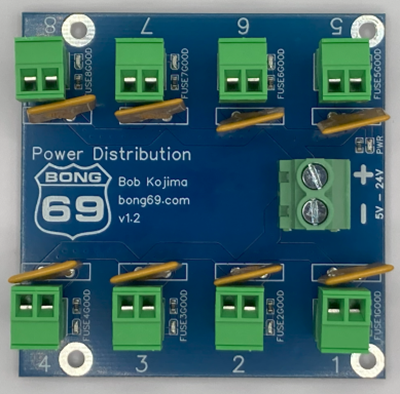
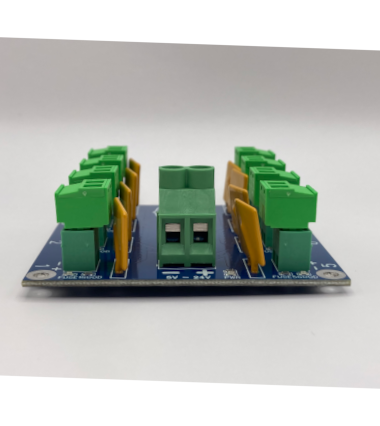
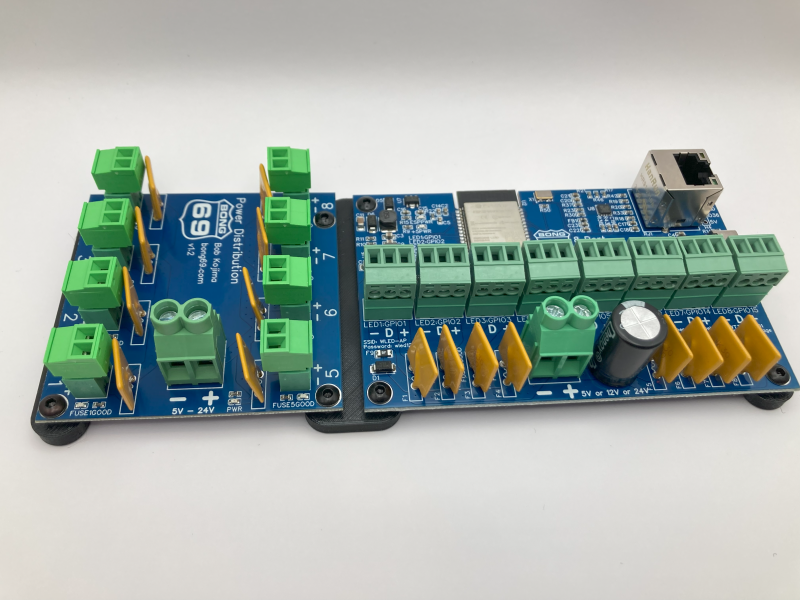

# Power Distribution

## What is it?
This is a power distributor used for LED power injection.  It can also be used when power needs to be split into 8 directions.

## Where can I get one?
The Power Distribution board is available for purchase at [Wasatch Lights](https://wasatchlights.com/products/bong-69-power-distribution-board).

## Specifications
The Power Distribution board has 8 removable Phoenix connectors that make wiring easy.  It also has 8 resettable fuse that never need to be replaced.
The LED next to each fuse indicates if the fuse is good.  An off LED means a fuse has been tripped.  Fuses can be rest by powering down the board.

- Voltage: 5v to 24v
- Input: 35A 10~22awg
- Output: 5A 16~28awg
- Fuse: 5A hold, 8A trip
  
The ideal installation would be to use a 30A power supply and to draw an average of 4A from each of the 8 output ports.

